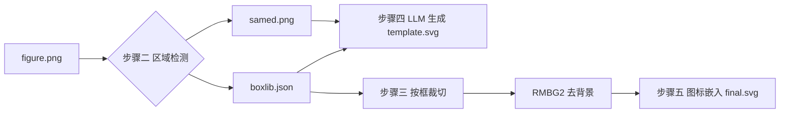

# 用多模态大模型替代 SAM3 的方法说明

本文档说明 AutoFigure-Edit 中 **`--sam_backend dashscope`** 的实现思路：用阿里云百炼视觉语言模型（默认 `qwen3-vl-plus`）的**物体定位（Grounding）**能力，替代 SAM3 完成流程**步骤二**的图标区域检测。

---

## 一、为什么要替代 SAM3？

SAM3 是专用的「文本提示 + 图像分割」模型，效果强，但部署成本高：

| 痛点 | 说明 |
|------|------|
| 本地依赖重 | 需安装 `sam3`、PyTorch、CUDA 等 |
| 外网 API | fal.ai / Roboflow 需额外 Key，内网可能不可达 |
| 与现有栈割裂 | 项目其它步骤已可用 DashScope（生图、SVG），分割却单独一套 |

多模态 VL 模型（如 Qwen3-VL）本身支持**按自然语言描述返回物体边界框**。本项目的后续步骤（裁切、去背景、生成 SVG）**只依赖矩形框坐标**，不强制要求像素级 mask。因此可以用「VL 物体定位」替换「SAM3 分割」，在接口层保持与原来一致。

---

## 二、核心思路：从「分割模型」到「视觉定位」

### 2.1 SAM3 在做什么？

SAM3 根据文本提示（如 `icon`、`person`）在图上找出对应区域，输出检测框（或 mask 再转框）。AutoFigure 当前各后端最终都汇总为：

```json
{
  "x1": 120, "y1": 80, "x2": 240, "y2": 200,
  "score": 0.92,
  "prompt": "icon"
}
```

### 2.2 多模态大模型在做什么？

不调用分割网络，而是把**整张图 + 定位指令**发给 VL 模型，让模型以**结构化 JSON** 回答「某类物体在哪里」：

```
输入：figure.png + 「检测图中所有 icon，输出 bbox_2d…」
输出： [{"bbox_2d": [x1,y1,x2,y2], "label": "icon"}, ...]
```

坐标按百炼 Qwen3-VL 约定为 **0–999 的相对坐标**（相对原图宽高归一化），代码再换算为像素 `x1,y1,x2,y2`，写入与 SAM3 相同的 `boxlib.json`。

### 2.3 本质区别

| 维度 | SAM3 | DashScope VL（本方案） |
|------|------|------------------------|
| 模型类型 | 分割 / 检测专用模型 | 通用视觉理解 + 物体定位 |
| 输出 | 框或 mask（再转框） | 文本中的 JSON 框 |
| 坐标系 | 多为像素或 API 归一化 cxcywh | 0–999 相对坐标 → 程序换算像素 |
| 置信度 | 通常有稳定 `score` | 多数情况无 score，默认 1.0 |
| 部署 | 本地 GPU 或第三方 SAM API | 仅需 `DASHSCOPE_API_KEY` |

**重要**：这是**检测框替代**，不是 mask 的 1:1 替代。不规则图标的外接矩形会略大，裁切后靠步骤三的 RMBG2 去背景弥补。

---

## 三、在整体流程中的位置

步骤二在整条链路中的角色不变，只是「谁产出 box」换了实现：



**DashScope 分支只替换 B 的内部实现**；C、D 及之后步骤与 SAM3 完全共用同一套代码（合并重叠框、画灰底标签、写 `boxlib.json` 等）。

---

## 四、实现方法（代码层面）

实现集中在 `autofigure2.py` 的 `segment_with_sam3()`，当 `sam_backend == "dashscope"` 时走 VL 分支。

### 4.1 调用链

```
segment_with_sam3(..., sam_backend="dashscope")
    │
    ├─ 解析 sam_prompt → ["icon", "person", ...]   # 逗号分隔，每个词单独检测一轮
    │
    └─ 对每个 prompt：
           _call_sam_dashscope_vl_grounding(image, prompt, api_key, model)
               ├─ _sam_dashscope_grounding_prompt(prompt)   # 构造定位指令
               ├─ _call_openai_compatible_multimodal()      # DashScope 兼容 OpenAI 的多模态 API
               └─ _parse_vl_grounding_boxes()               # 从回复文本解析 JSON → 像素框
```

默认模型：环境变量 `AUTOFIGURE_MULTIMODAL_MODEL` / `MULTIMODAL_MODEL` / `SAM_DASHSCOPE_VL_MODEL`，未设置时为 **`qwen3-vl-plus`**。  
API 地址：`https://dashscope.aliyuncs.com/compatible-mode/v1`（与项目其它 DashScope 调用一致）。

### 4.2 定位提示词（Prompt 设计）

对每个类别（如 `icon`）使用固定模板，约束输出格式，减少废话：

```text
检测图中所有「icon」对象，以 JSON 数组输出，每个元素格式为
{"bbox_2d": [x1, y1, x2, y2], "label": "类别名"}。
坐标使用 0-999 的相对坐标（左上角为原点，x 向右，y 向下）。
只输出 JSON 数组，不要输出其它说明文字。
```

这与百炼文档中的「二维物体定位 / 返回 Box 坐标」用法一致。

### 4.3 坐标换算

模型返回的 `bbox_2d` 在 `[0, 999]` 空间，函数 `_qwen_vl_norm_box_to_xyxy()` 按原图宽高映射到像素：

```text
x_pixel = round(x_norm / 999 * image_width)
y_pixel = round(y_norm / 999 * image_height)
```

并做边界裁剪、保证 `x1 < x2`、`y1 < y2`。若数值已在像素范围（>999），则按像素直接解析。

### 4.4 结果解析

VL 回复是自然语言，可能带 Markdown 代码块。`_extract_json_payload_from_text()` 会：

1. 去掉 ` ```json ` 围栏；
2. 在文本中查找第一个合法 JSON 数组或对象；
3. 支持 `bbox_2d` / `bbox` / `box` / `bounding_box` 等字段名；
4. 支持外层包装如 `{"objects": [...]}`。

解析失败时该 prompt 本轮视为 0 个检测（打印错误，不中断全流程）。

### 4.5 与 SAM3 共用的后处理

VL 检测到的框进入与 SAM3 **相同** 的流水线：

1. **置信度过滤**：`--min_score`（VL 无 score 时视为 `1.0`）；
2. **重叠合并**：`merge_overlapping_boxes()`，`--merge_threshold`；
3. **编号**：`<AF>01`, `<AF>02`, …；
4. **产物**：`samed.png`（灰底黑框 + 白字标签）、`boxlib.json`。

因此下游**无需区分**框来自 SAM3 还是 VL。

---

## 五、配置与使用

### 5.1 环境变量

| 变量 | 说明 |
|------|------|
| `AUTOFIGURE_API_KEY` | 百炼 / 主流程 API Key（必填） |
| `AUTOFIGURE_PROVIDER` | API provider（如 `dashscope`） |
| `AUTOFIGURE_SAM_BACKEND` | 分割后端（如 `dashscope`） |
| `AUTOFIGURE_IMAGE_MODEL` | 步骤一文生图模型 |
| `AUTOFIGURE_SVG_MODEL` | 步骤四 SVG 模型 |
| `AUTOFIGURE_MULTIMODAL_MODEL` | 步骤二物体定位模型 |

### 5.2 命令行示例

```bash
python autofigure2.py --method_file paper.txt --output_dir ./output
```

所有 provider、Key、模型名均在 `.env` 配置，见 `.env.example`。

### 5.3 Web 界面

在 **SAM3 Backend** 下拉框选择 **DashScope VL (qwen3-vl-plus)**。若主 Provider 已是 dashscope，主 API Key 会自动传给分割步骤。

---

## 六、与 SAM3 的对比与选用建议

### 6.1 适合用 VL 替代的场景

- 无法安装本地 SAM3，且不想依赖 fal / Roboflow；
- 已有百炼账号，希望**生图 + 分割 + SVG** 统一用 DashScope；
- 示意图中对象较大、类别清晰（如明显的 icon、人物剪影）；
- 能接受矩形框略粗、小图标偶发漏检。

### 6.2 仍建议保留 SAM3 的场景

- 大量**小图标、密集排列**的论文示意图；
- 需要较稳定的 **score 过滤** 与检测数量控制（`max_masks`）；
- 对框的位置精度要求高，减少后续 SVG 对齐人工修图。

### 6.3 能力边界（务必了解）

| 项目 | 说明 |
|------|------|
| 无像素 mask | 只有外接矩形，不能沿轮廓精确抠图 |
| JSON 稳定性 | 依赖模型遵守格式，极端情况需重试或调 prompt |
| 多 prompt 成本 | 每个逗号分隔词单独调一次 API |
| 坐标系 | 必须按 0–999 换算；模型若输出错误尺度，框会漂移 |

---

## 七、小结

**方法一句话**：用 Qwen-VL 的「文本指定类别 → JSON 边界框」代替 SAM3 的「文本指定类别 → 分割/检测框」，在步骤二产出**相同结构的** `boxlib.json` 与 `samed.png`，后续裁切、去背景、SVG 生成逻辑不变。

**设计原则**：替换的是**区域检测的实现**，不是整条 AutoFigure 流程；对上游步骤一只要求有 `figure.png`，对下游只保证有可靠的 `(x1,y1,x2,y2)` 列表。

---

## 八、相关代码索引

| 功能 | 文件与符号 |
|------|------------|
| VL 定位调用 | `autofigure2.py` → `_call_sam_dashscope_vl_grounding` |
| 提示词模板 | `_sam_dashscope_grounding_prompt` |
| 坐标解析 | `_qwen_vl_norm_box_to_xyxy`, `_parse_vl_grounding_boxes` |
| 分支入口 | `segment_with_sam3` → `elif backend == "dashscope"` |
| CLI 参数 | `--sam_backend dashscope`, `--sam_vl_model` |
| 完整流程说明 | `autofigure2说明文档.md` |

官方参考：[百炼 Qwen-VL 视觉理解 — 物体定位](https://help.aliyun.com/zh/model-studio/user-guide/vision/)（二维定位返回 Box，坐标归一化至 `[0, 999]`）。
